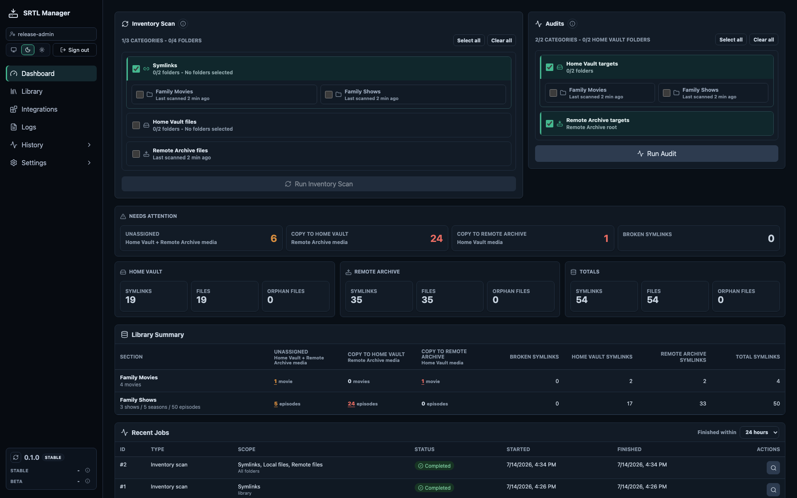
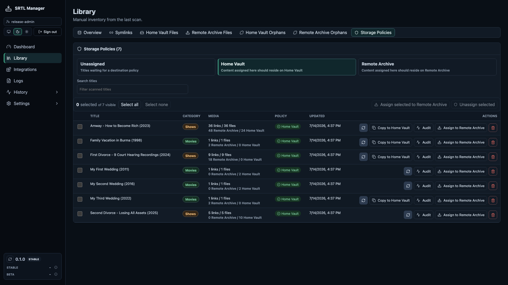
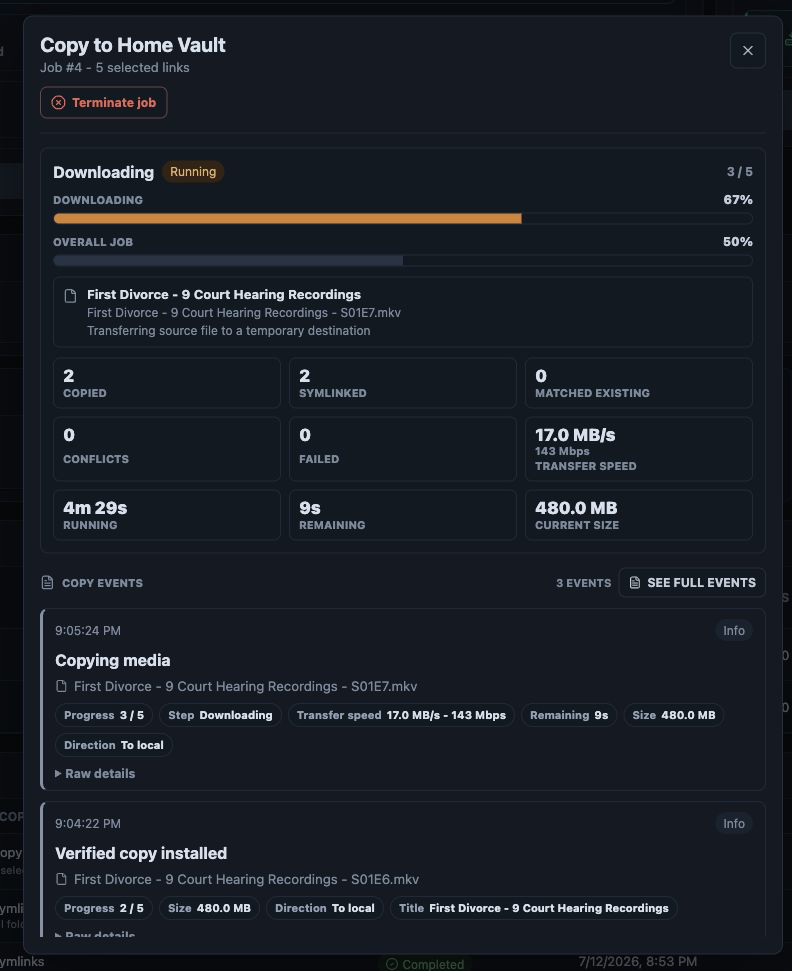

# SRTL Manager

Do you keep family videos in remote locations? Want the important ones, such as footage from your third wedding, stored locally so you can fall asleep to it every night without worrying that your WRT54G router might drop the signal and reboot for the ninth time today? Tired of manually repointing symlinks whenever those files move? SRTL Manager inventories local and remote storage, copies selected files in either direction, verifies transfers before switching links, and helps prevent a bad copy from freezing at the exact moment someone says, "I do." If your files have multiple homes but managing their symlinks should not be a full-time job, this app is for you.

SRTL Manager is a local-first web app for inventorying and maintaining a symlink-backed file library, with storage policies, audits, guarded copies, and durable job history in one focused interface.

## Highlights

- Guided first-run account, path, section, policy, and initial-scan setup.
- Symlink, local-root, remote-root, and orphan inventory with targeted title rescans.
- Per-location storage policies using editable friendly names, plus an Unassigned queue for newly discovered titles.
- Fast and deep audits across local and remote targets.
- Bidirectional copies with live progress, conflict handling, configurable verification, and source/title risk checks.
- Safe job termination, complete event timelines, restart recovery, and durable per-file copy journals.
- Required path-change review before changed mounts can affect managed links.
- Editable storage-location names while deployment paths remain environment-managed.
- Postgres-backed API and worker services in a hardened container stack.
- Dark, light, and system themes with responsive administration views.

SRTL Manager is early software. Keep backups and review copy and audit results before relying on unattended workflows.

## Screenshots

These screenshots come from a disposable fictional library built solely for documentation. They contain no private paths or real library data.

**Dashboard**



**Storage policies**



**Live copy progress**



## Quick Setup

Docker Engine, Docker Compose v2, and `curl` are required.

```bash
curl -fsSL -o docker-compose.yml https://raw.githubusercontent.com/ramphex/SRTL-Manager/main/docker-compose.yml
curl -fsSL -o .env.example https://raw.githubusercontent.com/ramphex/SRTL-Manager/main/.env.example
```

Copy `.env.example` to `.env`, then edit these deployment values before starting:

- `SYMLINK_DIR`: the existing absolute path containing the managed symlinks.
- `SRTL_LOCATION_1_PATH` and `SRTL_LOCATION_2_PATH`: existing absolute storage paths. Their friendly names are set during onboarding and can be changed later in Settings > Library.
- `SRTL_POSTGRES_PASSWORD`: your database password. It is entered only once.
- `SRTL_UID` and `SRTL_GID`: the host account that can read the managed roots and write to destinations used by copy jobs.
- `SRTL_BIND_HOST`, `SRTL_WEB_PORT`, and the security settings: review these if the defaults do not match your network or reverse proxy.

The administrator username and password are created in the browser during first-run setup and do not belong in `.env`.

Run `cp .env.example .env`, protect it with `chmod 600 .env`, validate it with `docker compose config --quiet`, then pull and start the stack:

```bash
docker compose pull
docker compose up -d
```

Open `http://<server-ip>:5179` unless a different port was selected. The browser then completes account creation, section setup, initial policy strategy, and the first scan.

The default configuration follows the current stable `latest` image. Pin `SRTL_IMAGE` to a numbered image tag when repeatable deployments are more important than automatically following stable updates.

## Deployment Model

`.env` is the single source of truth for deployment-owned paths, credentials, host binding, and ports. Persistent database files stay in `./data` beside `docker-compose.yml`; that path does not need configuration. Numbered storage-location variables keep deployment identity separate from friendly names managed in Settings > Library. Friendly names, section names, display order, policies, and user preferences live in Postgres.

The API receives read-only root mounts. The worker alone receives writable roots for copy and path-migration jobs. Postgres is reachable only inside the Compose network.

When a configured root changes, restart the stack. The UI enters maintenance mode until it validates and applies a path migration or the prior value is restored. This rebases managed paths; it does not move stored content.

## Backup And Restore

Create a database backup before upgrades or path changes:

```bash
docker compose exec -T postgres sh -c 'pg_dump -U "$POSTGRES_USER" "$POSTGRES_DB"' > srtl-manager-backup.sql
```

Restore into an empty database while app services are stopped:

```bash
docker compose stop api worker
docker compose exec -T postgres sh -c 'dropdb -U "$POSTGRES_USER" --if-exists "$POSTGRES_DB" && createdb -U "$POSTGRES_USER" "$POSTGRES_DB"'
docker compose exec -T postgres sh -c 'psql -U "$POSTGRES_USER" "$POSTGRES_DB"' < srtl-manager-backup.sql
docker compose start api worker
```

Keep `.env` and any `.env.backup.*` files private; they contain database credentials.

## Development

Requires Node.js 22 and Postgres 17.

```bash
npm ci
npm run dev
```

Development defaults are `http://localhost:5178` for the UI and port `3009` for the API. Run the complete local verification set with:

```bash
npm run check
npm run build
npm run test:e2e
```

## Releases And Contributions

- Pull requests target `beta`.
- `main` contains stable releases; `beta` is the integration branch for upcoming changes.
- Ordinary branch pushes run verification but do not publish images or releases.
- Stable releases publish matching numbered and `latest` container tags.
- Prereleases use the upcoming stable version plus an ordered suffix, such as `0.1.1-beta.1`.
- Small stable fixes increment the patch version; the next feature line increments the minor version.

See [CONTRIBUTING.md](CONTRIBUTING.md), [SECURITY.md](SECURITY.md), and [CHANGELOG.md](CHANGELOG.md).

## Roadmap

- External metadata and automation adapters.
- Optional remote source-availability preflight checks where providers expose reliable metadata.
- Event-driven targeted refresh hooks.
- Additional numbered storage locations and per-location assignment policies.
- Controlled multi-worker execution after single-worker recovery semantics are fully proven.

> **Beta builds:** When a beta image is available, set `SRTL_IMAGE=ghcr.io/ramphex/srtl-manager:beta` in `.env`. Beta builds contain newer work that has not yet been promoted to a stable release.
